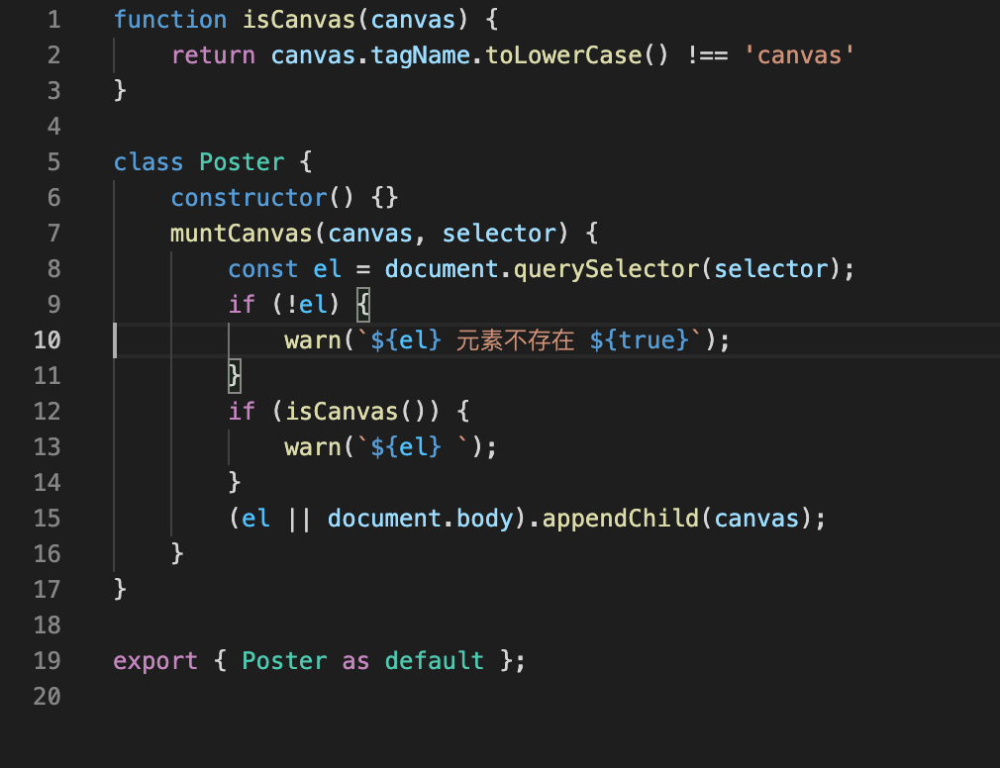
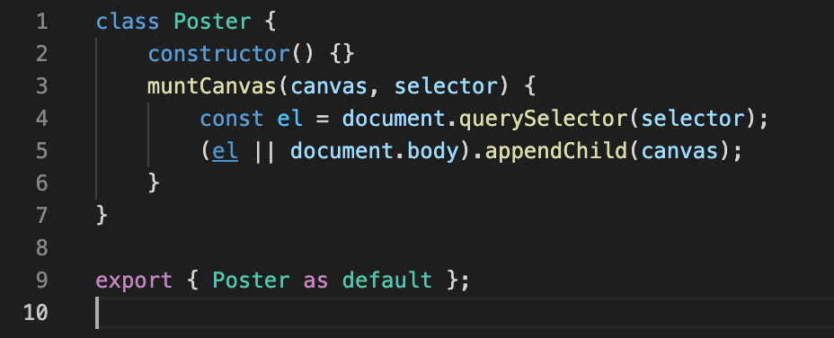

## 提升用户开发体验

### 友好的警告提示

在使用库或者框架的时候，提供友好的警告信息至关重要，这可以帮助开发者快速定位问题。

我们先定义一个简单的 warn 函数：

```javascript
function warn(msg) {
    console.warn(`[xxx warn] ${msg}`)
}
```

在必要的地方调用警告函数：

```javascript
class Poster {
    constructor() {}
    muntCanvas(canvas, el) {
        const el = document.querySelector(selector)
        if (!el) {
            warn(`${el} 元素不存在`)
        }
        if (canvas.tagName.toLowerCase() !== 'canvas') {
            warn(`${el} `)
        }
        (el || document.body).appendChild(canvas)
    }
}
```

### 统一的错误处理

当他人在使用我们封装好的库或框架时，经常会遇到程序报错的情况，不同的方式处理错误，带给使用者的体验也不同。

比如我们封装了一个请求库：

```javascript
class FileRequest {
    constructor(requester) {
        this.requester = requester
    }
    upload(url, options) {
        const file = new FormData()
        this.requester.post(url, {
            data: file
        })
        // ...
    }
}
```

用户在使用时可以自行处理错误信息：

```javascript
import axios from 'axios'
const fileRequest = new FileRequest(axios)

try {
    fileRequest.upload(//...)
} catch (err) {
    console.error(err.message)
}
```

也可以在库内部进行统一处理：

```javascript
class FileRequest {
    constructor(requester) {
        this.requester = requester
    }
    upload(url, options) {
        const file = new FormData()
        try {
            this.requester.post(url, {
                data: file
            })
        } catch (err) {
            // ...
        }
    }
}
```

不过我们还可以更进一步，对错误处理程序进行统一封装，并且为用户暴露错误处理接口：

```javascript
class FileRequest {
    constructor(requester) {
        this.requester = requester
        this.errorHandler = null
    }

    defaultErrorHandler(err) {
        console.error(`[Request error] ${err.message}`)
    }
    callWidthErrorHandler(cb) {
        try {
            cb && cb()
        } catch (err) {
            this.errorHandler
                ? this.errorHandler(err)
                : this.defaultErrorHandler(err)
        }
    }
    upload(url, options) {
        const file = new FormData()
        this.callWidthErrorHandler(() => {
            this.requester.post(url, {
                data: file
            })
        })
    }
    download(url) {
        this.callWidthErrorHandler(() => {
            this.requester.post(url)
            //...
        })
    }
}
```

这样用户才使用的时候，就可以自定义统一错误处理逻辑：

```javascript
import axios from 'axios'
const fileRequest = new FileRequest(axios)
fileRequest.errorHandler = function (err) {
    console.error(`[Custom error handler] ${err.message}`)
}
// ...
```

在 Vue.js 中，我们也可以注册统一的错误处理函数：

```javascript
// ...
const app = createApp(App)
app.config.errorHandler = () => {
    // ...
}
```

### 自定义 Chrome DevTools Formatter

关于 Chrome DevTools Formatter 相关，可以查看[Writing custom formatters for logged objects in Chrome](https://www.mattzeunert.com/2016/02/19/custom-chrome-devtools-object-formatters.html)。

### 控制代码体积

上面的代码中，我们在必要的地方加上了警告提示，但这些提示在生产环境其实并没有太大意义，因为普通用户并不关心。

而库的大小也是衡量一个库的标准之一，同样的功能，代码体积越小，请求加载越快。

所以这就意味着我们需要在生产环境中移除掉这些警告提示用的代码，这里我们可以通过一个常量来进行控制：

```javascript
import {isCanvas} from './utils'

class Poster {
    constructor() {}
    mountCanvas(canvas, el) {
        const el = document.querySelector(selector)
        if (__DEV__ && !el) {
            warn(`${el} 元素不存在 ${__DEV__}`)
        }
        if (__DEV__ && isCanvas()) {
            warn(`${el} `)
        }
        (el || document.body).appendChild(canvas)
    }
}
```

上面我们定义了一个常量 `__DEV__`，这个常量可以在通过 rollup 打包时进行替换。

安装 rollup 插件 `@rollup/plugin-replace`：

```bash
yarn add @rollup/plugin-replace -D
```

修改 rollup 配置：

```javascript
import replace from '@rollup/plugin-replace';

const NodeEnv = {
    dev: 'development',
    prod: 'production',
}
export default {
    input: './src/index.js',
    output: {
        file: './dist/index.js',
        format: 'esm'
    },
    plugins: [
      replace({
        '__DEV__': process.env.NODE_ENV === NodeEnv.dev,
      })
    ]
}
```

修改 `package.json` 的 scripts 命令：

```json
  "scripts": {
    "dev": "rollup -c --environment NODE_ENV:development",
    "build": "rollup -c --environment NODE_ENV:production"
  },
```

执行 `yarn dev`，常量 `__DEV__` 的值为 true，查看构建好的文件：



此时 if 条件语句里，警告用的代码存在。

执行 `yarn build`，常量 `__DEV__` 的值为 false，打开构建好的文件：



由于 if 条件为 false，所以条件语句内警告用的代码，在打包时就被 rollup 剔除了。

### 特性开关

一个成熟稳定的框架往往需要向后做一定的兼容，但假如开发过程中完全使用新语法，那框架里处理兼容的代码是不需要的。

所以我们就需要一个控制开关，别人在使用框架时就可以自行控制打包时是否需要保留这些特性。

实现这种控制开关的原理和上面的常量 `__DEV__` 类似，不过在构建框架的时候不做处理，而是暴露给使用者自己控制。

比如 Vue3 依然支持 Vue2 的 `optional` 语法：

```javascript
// ...
// support for 2.x options
if (__VUE_OPTIONS_API__ && !(false )) {
    setCurrentInstance(instance);
    pauseTracking();
    applyOptions(instance);
    resetTracking();
    unsetCurrentInstance();
}
// ...
```

上面代码中 `__VUE_OPTIONS_API__` 常量就是一个特性开关，如果我们的项目完全使用 `composition api`，那这些兼容用的代码其实是不需要的。

如果使用 `webpack` 构建项目，我们可以通过如下配置删除代码：

```javascript
// ...
plugins: [
    // Define Bundler Build Feature Flags
    new webpack.DefinePlugin({
        // Drop Options API from bundle
        __VUE_OPTIONS_API__: false,
    }),
}
```

如果使用 `vite`，则可以在 `vite.config.js` 里配置：

```javascript
// ...
define: {
    __VUE_OPTIONS_API__: false,
}
```

### 良好的 Tree-Shaking

上面已经通过预定义常量 `__DEV__` 的方式来删除生产环境中不必要的代码，但这还不够。

一个大型的工具库或者框架，不一定每个方法都会被使用，对于这些代码，我们希望在打包项目代码的时候能剔除掉，这就需要框架有良好 `Tree-Shaking` 支持。